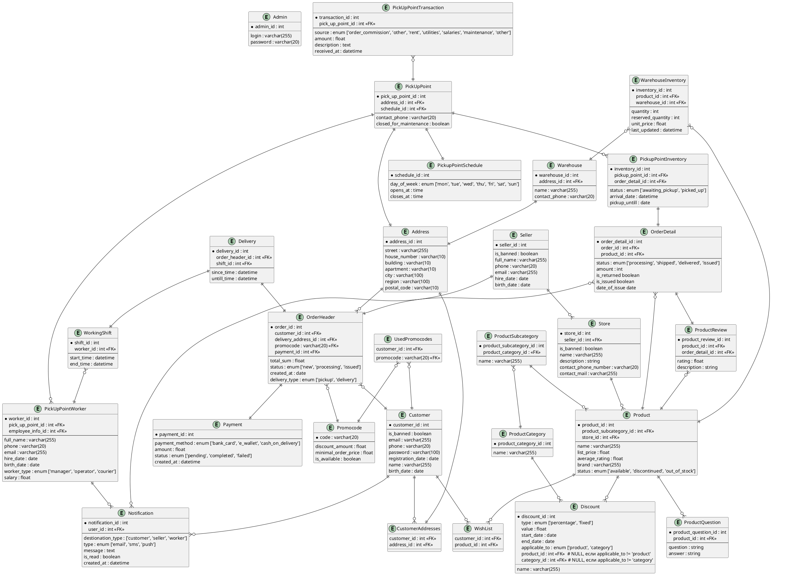

# M3203_VlasovAA

# Проектирование баз данных

# Предметная область: OZON (маркетплейс)

# Функциональные требования

1. **Регистрация и авторизация пользователей:**

    - Система должна предоставлять возможность регистрации новых пользователей (покупателей и продавцов) через email или
      номер телефона.

    - Система должна обеспечивать авторизацию зарегистрированных пользователей.

    - Система должна поддерживать восстановление пароля в случае его утери.

2. **Управление профилем пользователя:**

    - Покупатели должны иметь возможность редактировать свои личные данные (имя, адрес, телефон, email).

    - Продавцы должны иметь возможность добавлять и редактировать информацию о своем магазине (название, описание,
      контакты).

3. **Поиск и фильтрация товаров:**

    - Система должна предоставлять возможность поиска товаров по ключевым словам, категория, подкатегориям какой-либо
      категории, брендам и другим параметрам.

    - Пользователи должны иметь возможность фильтровать товары по цене, рейтингу, наличию, доставке и другим критериям.

    - Должны существовать категории и подкатегории, которые должны наследоваться от какой-либо категории

4. **Просмотр карточки товара:**

    - Для каждого товара должна быть доступна детальная информация: название, описание, цена, скидка, отзывы, рейтинг,
      наличие на складе.

    - Пользователи должны иметь возможность оставлять отзывы и оценки для товаров.

    - Пользователи могут задавать вопросы по товарам. Эти вопросы и ответы на них могут просматривать другие
      пользователи в карточке товаров.

5. **Управление корзиной и оформление заказа:**

    - Пользователи должны иметь возможность добавлять товары в корзину, изменять количество товаров и удалять их из
      корзины.

    - Система должна предоставлять возможность оформления заказа с выбором способа оплаты и доставки.

    - Среди выборов способов оплаты должны быть карты/наличные

    - Среди выборов способов доставки должны быть ПВЗ/доставка курьером
   
    - Пользователи должны иметь возможность отслеживать статус заказа.

    - Кроме корзины пользователь может лайкнуть товар

    - Пользователь имеет возможность вернуть товар
6. **Оплата товаров:**

    - Система должна поддерживать различные способы оплаты: банковские карты, электронные кошельки, оплата при
      получении.

7. **Доставка товаров:**

    - Система должна предоставлять выбор способов доставки: курьерская доставка, самовывоз в пункт выдачи заказов.

    - Пользователи должны иметь возможность отслеживать статус доставки.

8. **Управление заказами для продавцов:**

    - Продавцы должны иметь возможность добавлять, редактировать и удалять товары в своем магазине.

    - Продавцы должны видеть список заказов, их статусы и контактные данные покупателей.

9. **Система уведомлений:**

    - Пользователи должны получать уведомления о статусе заказа, акциях и новых поступлениях через email, SMS или
      push-уведомления.

10. **Администрирование системы:**

    - Администратор должен иметь возможность управлять пользователями, продавцами, товарами, заказами и настройками
      системы.

    - Администратор должен иметь возможность забанить продавца/пользователя

    - Администратор должен иметь доступ к аналитике: продажи, популярные товары, активность пользователей

11. **Система учета и хранения данных о заказе**

    - Для ПВЗ должны вестись часы работы, учет расходов и доходов

    - Должен вестись учет рабочих в ПВЗ и доставщиков 

    - Для доставщиков следует хранить их расписание, их заказы с указанными маршрутами доставки

12. **Система скидок и акций:**

    - Система должна поддерживать создание скидок, акций и промокодов для товаров.

    - Пользователи должны иметь возможность применять промокоды, действующие на все товары (на всю корзину).

13. **Рекомендации и персонализация:**

    - Система должна предлагать персонализированные рекомендации товаров на основе истории покупок и просмотров
      пользователя.

# ERD

